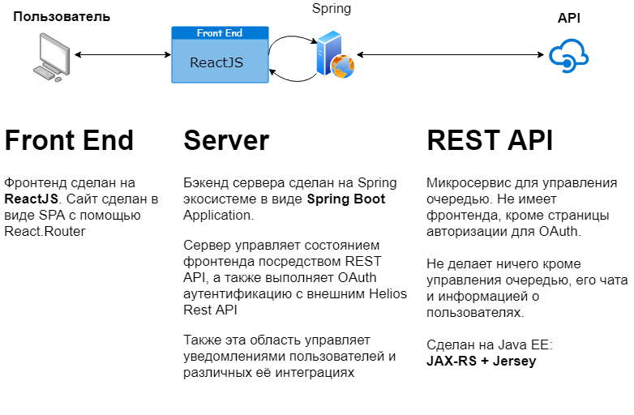

# Backend for Helios
<h1 align=center>
  
  
</h1>
Backend for helios using Spring Boot

## Репозитории действующих проектов
* [Front End (ReactJS)](https://github.com/AppLoidx/helios-front-end)
* [Backend (Spring Boot)](https://github.com/AppLoidx/helios-backend)
* [REST API (JAX-RS)](https://github.com/AppLoidx/helios-rest-api)

